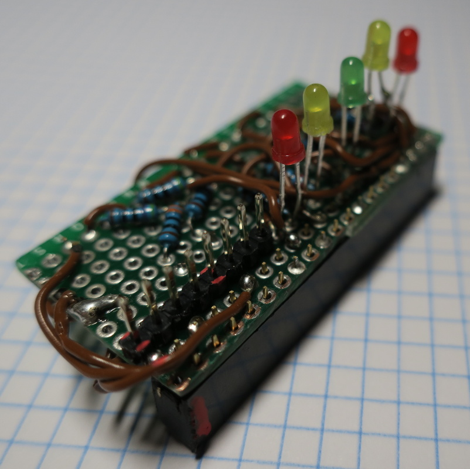

# Opabinia - circuit layout

This page details a little how the circuit was made to fit
onto a 27 x 52 mm prototype pcb and soldered to become a
board ready to plug on the RPi's 20x2 GPIO pin set.

The pcb is sawed off to achieve the desired dimension, with
20x10 holes. Two sets of breakout pins will be soldered to
the board: a 20x2 female block for the RPi GPIO, and an
8x1 male set for the two proximity sensors.

The female block faces "downwards" and the male block "upward",
as in the following sketch:

The precise location of each pin, each connection and each blob of tin
is detailed here below. One should be careful to think carefully the right order
when soldering (e.g. first the ground row, then the echo resistors, then the LED
sets, then the male breakout and finally the female breakout).

## The result

Soldered board:

Plugged on the RPi:

## Further suggestion

One could restructure the above layout to make the board still
fit as an add-on to the RPi, but inward-facing, i.e. almost completely
hidden into the Raspberry case (except for the sensor pins and the LEDs).

This exercise is left to the reader (_because that was the original plan,
but due to a major overlooking I ended up with the board orientation as
shown and now I will happily stick to it_).
